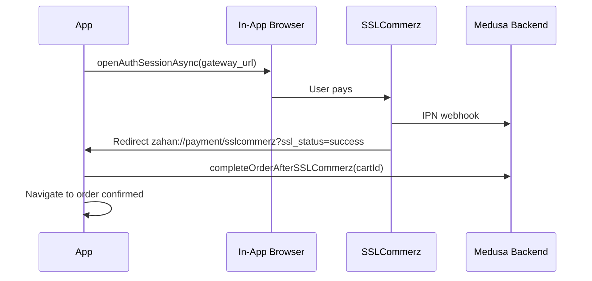

# ZAHAN Mobile App — Full Build Guide

> **Audience:** AI coding agents and developers building the React Native app in `mobile/`.  
> **Goal:** Feature parity with `demo-clothing-store-storefront` — same brand, theme, commerce flows, and Medusa backend.  
> **Rule:** Never use a WebView wrapper. Build native screens. Import design tokens from `mobile/design/` — never hardcode colors.

---

## Table of Contents

1. [Project Overview](#1-project-overview)
2. [Tech Stack](#2-tech-stack)
3. [Initialize the Project](#3-initialize-the-project)
4. [Target Folder Structure](#4-target-folder-structure)
5. [Design System (Web → Mobile)](#5-design-system-web--mobile)
6. [Feature Parity Checklist](#6-feature-parity-checklist)
7. [Navigation Architecture](#7-navigation-architecture)
8. [Data Layer (Port from Web)](#8-data-layer-port-from-web)
9. [Auth & Session (Replace Cookies)](#9-auth--session-replace-cookies)
10. [Screen-by-Screen Specs](#10-screen-by-screen-specs)
11. [Component Library](#11-component-library)
12. [Payment Flows](#12-payment-flows)
13. [Bangladesh Checkout Logic](#13-bangladesh-checkout-logic)
14. [Third-Party Integrations](#14-third-party-integrations)
15. [Backend APIs (Including Unused Web APIs)](#15-backend-apis-including-unused-web-apis)
16. [Assets to Copy from Web](#16-assets-to-copy-from-web)
17. [Mobile UI/UX Guidelines](#17-mobile-uiux-guidelines)
18. [Phase-by-Phase Build Plan](#18-phase-by-phase-build-plan)
19. [Environment Variables](#19-environment-variables)
20. [Testing Checklist](#20-testing-checklist)
21. [Known Web Gaps & Decisions](#21-known-web-gaps--decisions)

---

## 1. Project Overview

### What exists today

| Layer | Path | Stack |
|-------|------|-------|
| Backend | `demo-clothing-store/` | Medusa v2, SSLCommerz, SMS OTP, Pathao |
| Web storefront | `demo-clothing-store-storefront/` | Next.js 16, React 19, Tailwind, Medusa SDK |
| Mobile (this) | `mobile/` | **To be built** — Expo + React Native |

### Brand

- **Name:** ZAHAN Fashion and Lifestyle
- **Primary color:** `#56AEBF` (teal)
- **Commerce CTAs:** Slate-900 (`#0F172A`) on white cards
- **Marketing pages:** Black + teal glassmorphism
- **Default region:** `bd` (Bangladesh)

### URL pattern on web

All routes: `/{countryCode}/path` (e.g. `/bd/store`).  
Mobile uses the same `countryCode` in app state (default `bd`), not in every URL segment.

---

## 2. Tech Stack

| Concern | Choice | Why |
|---------|--------|-----|
| Framework | **Expo SDK 56** | React 19, RN 0.85, Reanimated 4; OTA + deep linking |
| Navigation | **Expo Router v4** | File-based routing (similar to Next.js) |
| Language | **TypeScript** | Matches web storefront |
| API | **@medusajs/js-sdk** | Reuse same SDK as web |
| State | **Zustand** | Cart ID, auth token, region, checkout draft |
| Auth storage | **expo-secure-store** | Replaces httpOnly cookies |
| Styling | **StyleSheet + design tokens** | From `mobile/design/theme.ts` |
| Fonts | **expo-font** + `@expo-google-fonts/inter` + `montserrat` | Matches web typography |
| Images | **expo-image** | Fast caching, blur placeholder |
| Lists | **FlashList** (`@shopify/flash-list`) | Product grids performance |
| Payments — SSLCommerz | **expo-web-browser** + deep link | In-app browser redirect (cards, bKash, Nagad) |
| Payments — COD | Medusa system default | Plain `cart.complete` API call |
| Analytics | **react-native-fbsdk-next** or **expo-tracking-transparency** + Meta SDK | Replaces web FB Pixel |
| Icons | **lucide-react-native** | Matches web Lucide usage |

### Do NOT use

- Capacitor, Cordova, Ionic WebView shells
- Tailwind on mobile (optional NativeWind later — start with tokens)
- `@medusajs/ui` (web-only)
- Next.js server actions (reimplement as client SDK calls)

---

## 3. Initialize the Project

Run from repo root. The app scaffolds **inside** `mobile/` (merge with existing `design/` folder).

```bash
cd mobile

# Create Expo app in current directory (merge with existing files)
npx create-expo-app@latest . --template tabs

# Core dependencies
npx expo install expo-router expo-linking expo-constants expo-status-bar
npx expo install expo-secure-store expo-web-browser expo-font expo-image
npx expo install @react-native-async-storage/async-storage
npx expo install react-native-safe-area-context react-native-screens
npx expo install react-native-gesture-handler react-native-reanimated

# Commerce
yarn add @medusajs/js-sdk @medusajs/types zustand
yarn add @shopify/flash-list lucide-react-native

# Payments: no native deps needed.
# SSLCommerz uses expo-web-browser (already installed); COD is a plain API call.

# Fonts
npx expo install @expo-google-fonts/inter @expo-google-fonts/montserrat

# Optional: Meta SDK for analytics
# yarn add react-native-fbsdk-next
```

### `app.json` essentials

```json
{
  "expo": {
    "name": "ZAHAN",
    "slug": "zahan-store",
    "scheme": "zahan",
    "ios": {
      "bundleIdentifier": "com.zahan.store",
      "associatedDomains": ["applinks:zahan.com.bd"]
    },
    "android": {
      "package": "com.zahan.store",
      "intentFilters": [
        {
          "action": "VIEW",
          "autoVerify": true,
          "data": [{ "scheme": "zahan", "host": "*" }],
          "category": ["BROWSABLE", "DEFAULT"]
        }
      ]
    },
    "plugins": [
      "expo-router",
      "expo-secure-store",
      "expo-font"
    ]
  }
}
```

> No Stripe plugin — the backend only uses SSLCommerz + Cash on Delivery, so
> there are no custom native payment modules. The app runs fully in **Expo Go**.

---

## 4. Target Folder Structure

```
mobile/
├── app/                              # Expo Router
│   ├── _layout.tsx                   # Root: fonts, providers
│   ├── (tabs)/
│   │   ├── _layout.tsx               # Tab bar: Home, Shop, Cart, Account
│   │   ├── index.tsx                 # Home
│   │   ├── shop.tsx                  # Store catalog
│   │   ├── cart.tsx                  # Cart
│   │   └── account.tsx               # Account hub
│   ├── product/[handle].tsx          # PDP
│   ├── category/[...handle].tsx      # Category listing
│   ├── collection/[handle].tsx       # Collection listing
│   ├── checkout/
│   │   ├── index.tsx                 # Consolidated checkout
│   │   └── review.tsx                # Review + pay step
│   ├── order/
│   │   ├── [id]/confirmed.tsx        # Order success
│   │   └── [id]/transfer/[token].tsx # Order transfer
│   ├── account/
│   │   ├── login.tsx
│   │   ├── register.tsx
│   │   ├── profile.tsx
│   │   ├── orders.tsx
│   │   ├── orders/[id].tsx
│   │   ├── addresses.tsx
│   │   └── forgot-password.tsx
│   ├── static/
│   │   ├── about.tsx
│   │   ├── contact.tsx
│   │   ├── offers.tsx
│   │   ├── returns.tsx
│   │   ├── shipping-info.tsx
│   │   ├── privacy-policy.tsx
│   │   └── terms-of-service.tsx
│   └── payment/
│       └── sslcommerz-callback.tsx   # Deep link handler
├── src/
│   ├── api/
│   │   ├── sdk.ts                    # Medusa SDK instance
│   │   ├── cart.ts                   # Port from web lib/data/cart.ts
│   │   ├── customer.ts
│   │   ├── products.ts
│   │   ├── orders.ts
│   │   ├── checkout.ts
│   │   ├── regions.ts
│   │   ├── categories.ts
│   │   ├── collections.ts
│   │   ├── payment.ts
│   │   ├── fulfillment.ts
│   │   ├── sslcommerz.ts
│   │   └── password-reset.ts
│   ├── stores/
│   │   ├── auth-store.ts
│   │   ├── cart-store.ts
│   │   └── region-store.ts
│   ├── components/
│   │   ├── ui/                       # Button, Input, Card, Badge, Skeleton
│   │   ├── product/                  # ProductCard, ProductGrid, Price
│   │   ├── cart/                     # CartItem, CartSummary
│   │   ├── checkout/                 # AddressForm, DistrictSelect, PaymentSelector
│   │   ├── home/                     # Hero, CategoryShowcase, TrustSection
│   │   └── layout/                   # Header, TabBar, WhatsAppFAB
│   ├── hooks/
│   │   ├── use-cart.ts
│   │   ├── use-region.ts
│   │   └── use-auth.ts
│   └── utils/
│       ├── money.ts                  # Port convertToLocale
│       ├── get-product-price.ts
│       ├── sort-products.ts
│       ├── facebook-analytics.ts
│       └── storage.ts                # SecureStore + AsyncStorage wrappers
├── design/                           # ← Already exists. Source of truth.
├── assets/
│   ├── logos/
│   ├── banners/
│   └── payments/
└── MOBILE_BUILD_GUIDE.md
```

---

## 5. Design System (Web → Mobile)

### Source files

| Mobile | Web equivalent |
|--------|----------------|
| `design/theme.ts` | `tailwind.config.js` + `globals.css` |
| `design/typography.ts` | `globals.css` `.typography-*` classes |
| `design/constants.ts` | `src/lib/constants.tsx` + district list |

### Color usage rules

| Context | Colors | Web reference |
|---------|--------|---------------|
| Header / tab bar | `grey.0` bg, `grey.20` border | `nav/index.tsx` |
| Primary commerce CTA | `slate.900` bg, white text | `product-preview/index.tsx` |
| Brand marketing CTA | `brand.teal` bg, `brand.tealHover` pressed | `about/page.tsx` |
| Sale badge | `sale` (#EF4444) | Product cards |
| Footer (in account/static) | `dark.bg` + `brand.teal` text | `footer/index.tsx` |
| WhatsApp FAB | `whatsapp` green, bottom-right fixed | `whatsapp-chat-button` |

### Typography mapping

| Web class | Mobile `textStyles` key | Font |
|-----------|---------------------------|------|
| `.typography-brand` | `brand` | Montserrat 700 |
| `.typography-hero` | `hero` | Montserrat 700 |
| `.typography-section-heading` | `sectionHeading` | Montserrat 600 |
| `.typography-body` | `body` | Inter 400 |
| `.typography-product-title` | `productTitle` | Inter 500 |
| `.typography-button` | `button` | Inter 600 |
| `.typography-nav` | `nav` | Inter 500 |

### Component style recipes

**Product card** (match `product-preview/index.tsx`):
```
Container: white bg, borderRadius.rounded, shadows.md → shadows.xl on press
Image: 1:1 aspect, grey.10 placeholder
Title: textStyles.productTitle, grey.90, 2 lines max
Price: textStyles.productPrice, grey.90
Discount badge: sale bg, top-left, borderRadius.soft
Strikethrough badge: slate.900 bg, bottom-right
CTA: slate.900 full-width button, textStyles.button
```

**Trust section card** (match `trust-section/index.tsx`):
```
white bg, borderRadius.xl, shadows.sm
Icon pill: gradient bg per feature, borderRadius.rounded
```

**Checkout form** (match Medusa field style):
```
Input: grey.10 bg, grey.20 border, borderRadius.base
Focus: brand.teal border
Radio selected: brand.teal accent
```

### Animation

| Interaction | Spec | Web reference |
|-------------|------|---------------|
| Hero carousel | 5s autoplay, 2s opacity crossfade | `home-hero/index.tsx` |
| Card press | scale 0.98, shadows increase | `image-hover-zoom` |
| Mobile menu | spring `animation.spring` | `mobile-menu/index.tsx` |
| WhatsApp pulse | 10s ping on mount | `whatsapp-chat-button` |
| Page transitions | 300ms slide from right | Expo Router default |

---

## 6. Feature Parity Checklist

Use this as the definitive scope. Mark each `[ ]` → `[x]` as built.

### Core commerce

- [x] **Home** — announcement, hero carousel, category showcase, featured collections, trust section, CTA
- [x] **Store catalog** — sort, category filter, search, pagination (12/page, infinite scroll)
- [x] **Category pages** — handle routing
- [x] **Collection pages** — featured collections on home
- [x] **Product detail** — variant picker, image gallery, add to cart, Buy Now, related products, reviews
- [x] **Cart** — line items, qty update, remove, promo code, free-shipping nudge
- [x] **Checkout** — consolidated form (address + district + shipping + payment)
- [x] **Checkout review** — order summary + place order
- [x] **Order confirmed** — thank you, order details, help section

### Payments

- [x] **Cash on Delivery** — `pp_system_default`
- [x] **SSLCommerz** — redirect + callback deep link (cards + mobile banking)
- [x] **bKash / Nagad** — virtual providers → SSLCommerz with `selected_gateway`

### Account

- [x] **Login** — email/password
- [x] **Register** — name, email, phone, password
- [x] **Logout**
- [x] **Profile** — name, email, phone
- [x] **Addresses** — list, add, edit, delete
- [x] **Orders** — list + detail
- [x] **Order transfer** — request, accept, decline
- [x] **Password reset** — SMS OTP flow (3 steps)

### Region

- [x] **Default region** — `bd` on first launch
- [~] **Region switcher** — store supports `setCountry`; single-region UI for now
- [x] **Multi-currency display** — `convertToLocale` with `noDivisionCurrencies`

### Static / info pages

- [x] About, Contact, Offers, Returns, Shipping Info, Privacy Policy, Terms of Service

### Integrations

- [x] **WhatsApp** FAB — `wa.me/8801304117711`
- [x] **Facebook Pixel events** — ViewContent, AddToCart, InitiateCheckout, Purchase (native SDK optional)
- [x] **Social links** — Facebook, Instagram, YouTube in footer/about

### Enhancements (backend exists, web doesn't use — **include in mobile v1**)

- [x] **Hero slides API** — `GET /store/hero-slides` (dynamic carousel with branded fallback)
- [x] **Product reviews** — `GET/POST /store/reviews/product/:id`
- [x] **Search suggestions** — `GET /store/search-suggestions?q=`
- [x] **Best selling** — `GET /store/best-selling`
- [x] **Free shipping threshold** — `GET /store/free-shipping-threshold`

### Explicitly out of scope (web also lacks)

- Live courier tracking API (static shipping-info page only)
- In-app return request flow (static returns policy only)
- Gift cards (stubbed on web)

---

## 7. Navigation Architecture

### Tab bar (primary — always visible)

| Tab | Icon (Lucide) | Route | Badge |
|-----|---------------|-------|-------|
| Home | `Home` | `/(tabs)/` | — |
| Shop | `ShoppingBag` | `/(tabs)/shop` | — |
| Cart | `ShoppingCart` | `/(tabs)/cart` | Item count |
| Account | `User` | `/(tabs)/account` | — |

**Tab bar style:** white bg, `grey.20` top border, `brand.teal` active tint, `grey.50` inactive.

### Stack screens (push navigation)

- Product, Category, Collection → push from Home/Shop
- Checkout → push from Cart (hide tab bar)
- Account sub-screens → push from Account tab
- Static pages → push from footer links or settings

### Deep links

| Link | Handler |
|------|---------|
| `zahan://payment/sslcommerz?ssl_status=success&...` | `app/payment/sslcommerz-callback.tsx` |
| `zahan://order/{id}/confirmed` | Order success screen |
| `https://zahan.com.bd/bd/products/{handle}` | Universal link → product screen |

---

## 8. Data Layer (Port from Web)

### SDK setup (`src/api/sdk.ts`)

Port from `demo-clothing-store-storefront/src/lib/config.ts`:

```typescript
import Medusa from "@medusajs/js-sdk"

export const sdk = new Medusa({
  baseUrl: process.env.EXPO_PUBLIC_MEDUSA_BACKEND_URL!,
  debug: __DEV__,
  publishableKey: process.env.EXPO_PUBLIC_MEDUSA_PUBLISHABLE_KEY,
})
```

### Web → Mobile porting map

| Web file | Mobile file | Changes required |
|----------|-------------|------------------|
| `lib/data/cart.ts` | `src/api/cart.ts` | Replace cookies with `cart-store`; remove `revalidateTag`; remove `redirect()` |
| `lib/data/customer.ts` | `src/api/customer.ts` | JWT in SecureStore; `signout` clears store |
| `lib/data/products.ts` | `src/api/products.ts` | Remove Next.js cache options; add pull-to-refresh |
| `lib/data/checkout.ts` | `src/api/checkout.ts` | Return result object instead of `redirect()` |
| `lib/data/sslcommerz.ts` | `src/api/sslcommerz.ts` | Same logic; use `EXPO_PUBLIC_MEDUSA_BACKEND_URL` |
| `lib/data/password-reset.ts` | `src/api/password-reset.ts` | Identical raw fetch calls |
| `lib/data/orders.ts` | `src/api/orders.ts` | Remove cache tags |
| `lib/data/regions.ts` | `src/api/regions.ts` | Cache in memory + AsyncStorage |
| `lib/data/categories.ts` | `src/api/categories.ts` | Direct port |
| `lib/data/collections.ts` | `src/api/collections.ts` | Direct port |
| `lib/data/payment.ts` | `src/api/payment.ts` | `cache: no-store` → always fresh fetch |
| `lib/data/fulfillment.ts` | `src/api/fulfillment.ts` | Direct port |
| `lib/util/money.ts` | `src/utils/money.ts` | Direct port |
| `lib/util/get-product-price.ts` | `src/utils/get-product-price.ts` | Direct port |
| `lib/util/sort-products.ts` | `src/utils/sort-products.ts` | Direct port |
| `lib/constants.tsx` | `design/constants.ts` | Already ported |

### Key API functions to implement (priority order)

**P0 — MVP**
1. `listRegions`, `getRegion`
2. `getOrSetCart`, `retrieveCart`, `addToCart`, `updateLineItem`, `deleteLineItem`
3. `listProducts`, `listProductsWithSort`
4. `listCategories`, `getCategoryByHandle`
5. `listCartShippingMethods`, `listCartPaymentMethods`
6. `prepareCheckout`, `placeOrder`
7. `login`, `signup`, `signout`, `retrieveCustomer`

**P1 — Full parity**
8. `completeOrderAfterSSLCommerz`, `getCartIdFromSession`
9. `listOrders`, `retrieveOrder`
10. `addCustomerAddress`, `updateCustomerAddress`, `deleteCustomerAddress`
11. `applyPromotions`
12. `updateRegion` (cart region switch)
13. `requestPasswordReset`, `verifyOTP`, `resetPassword`
14. `createTransferRequest`, `acceptTransferRequest`, `declineTransferRequest`

**P2 — Enhancements**
15. Hero slides, reviews, search suggestions, best-selling, free-shipping threshold

---

## 9. Auth & Session (Replace Cookies)

### Web cookies → Mobile storage

| Web cookie | Mobile storage | Key |
|------------|----------------|-----|
| `_medusa_jwt` | `expo-secure-store` | `medusa_jwt` |
| `_medusa_cart_id` | `AsyncStorage` | `medusa_cart_id` |
| `_medusa_cache_id` | Not needed | — |

### Auth header helper

```typescript
// src/utils/storage.ts
export async function getAuthHeaders(): Promise<Record<string, string>> {
  const token = await SecureStore.getItemAsync("medusa_jwt")
  return token ? { authorization: `Bearer ${token}` } : {}
}
```

### Cart lifecycle

1. On app launch: read `medusa_cart_id` from AsyncStorage → `retrieveCart`
2. If no cart or invalid: `getOrSetCart(regionId)` → save new ID
3. On login/signup: `sdk.store.cart.transferCart(cartId)` → merge guest cart
4. On logout: clear JWT + cart ID
5. On order complete: clear cart ID

---

## 10. Screen-by-Screen Specs

### Home `/(tabs)/index.tsx`

**Web ref:** `src/app/[countryCode]/(main)/page.tsx`

| Section | Component | Data |
|---------|-----------|------|
| Announcement bar | `AnnouncementBar` | `ANNOUNCEMENT` constant; dark gradient bg |
| Hero carousel | `HeroCarousel` | `HERO_SLIDES` or `GET /store/hero-slides` |
| Category showcase | `CategoryShowcase` | `listCategories` + top 6 with products |
| Featured collections | `FeaturedCollections` | First 3 collections × 4 products |
| Trust section | `TrustSection` | Static (Truck, Shield, RefreshCcw, Headphones, Award, Clock) |
| CTA section | `CTASection` | Facebook group link |
| WhatsApp FAB | `WhatsAppFAB` | Fixed bottom-right, above tab bar |

**Pull-to-refresh:** re-fetch categories + featured products.

---

### Shop `/(tabs)/shop.tsx`

**Web ref:** `src/modules/store/templates/index.tsx`

**Query state (URL params or local state):**
- `sortBy`: `popularity` | `created_at` | `price_asc` | `price_desc`
- `page`: number (default 1)
- `search`: string
- `category`: category ID

**Layout:**
- Sticky search bar at top
- Horizontal category chips (scrollable)
- Sort + filter bottom sheet (mobile-native)
- `FlashList` 2-column product grid
- Pagination: infinite scroll (load next page at bottom)

**API:** `listProductsWithSort({ countryCode, sortBy, page, queryParams })`

---

### Product Detail `app/product/[handle].tsx`

**Web ref:** `src/modules/products/templates/index.tsx`

**Sections:**
1. Image gallery — swipeable, pinch-to-zoom optional
2. Title, price, discount badge
3. Variant selector (size/color chips)
4. Quantity stepper
5. Add to Cart (slate.900) + Buy Now (secondary)
6. Description (Markdown → `react-native-markdown-display`)
7. Related products horizontal scroll

**Analytics:** `trackViewContent` on mount, `trackAddToCart` on add.

**API:** `listProducts({ handle })`, `addToCart`

---

### Cart `/(tabs)/cart.tsx`

**Web ref:** `src/modules/cart/templates/index.tsx`

- Line items with image, title, variant, qty regulator, delete
- Sign-in prompt for guests (link to login)
- Promo code input
- Summary: subtotal, shipping estimate, discount, total
- CTA: "Proceed to Checkout" (slate.900, full width)
- Empty state: illustration + "Browse Products" CTA

---

### Checkout `app/checkout/index.tsx`

**Web ref:** `consolidated-checkout-form/index.tsx`

**Single scrollable form:**

1. **Contact** — email (required)
2. **Shipping address** — first/last name, address, district (searchable dropdown), phone
3. **Delivery type** — Home delivery / Pickup toggle
4. **Shipping method** — auto-select based on district (see §13)
5. **Payment method** — radio list with icons (Cash on Delivery, bKash, Nagad, Card via SSLCommerz)
6. **Delivery instructions** — optional textarea
7. **Order summary** — collapsed card at bottom

**CTA:** "Review Order" → calls `prepareCheckout()` → navigate to review screen.

**Persist:** save form to AsyncStorage key `checkout_form_state` (match web).

---

### Checkout Review `app/checkout/review.tsx`

**Web ref:** `checkout/components/review/index.tsx` + `payment-button/index.tsx`

- Read-only address + shipping + payment summary
- Edit links → back to checkout
- Total prominently displayed
- "Place Order" button:
  - COD → `placeOrder()`
  - SSLCommerz (incl. bKash/Nagad) → open gateway URL in `expo-web-browser`

---

### Order Confirmed `app/order/[id]/confirmed.tsx`

**Web ref:** `order-completed-template.tsx`

- Success animation (checkmark)
- Order number, items, shipping, payment method
- "Continue Shopping" CTA
- `trackPurchase` analytics event

---

### Account `/(tabs)/account.tsx`

**Web ref:** account parallel routes

**Logged out:** Login + Register tabs (same as `login-template.tsx`)
**Logged in:** Overview cards → Profile, Orders, Addresses, Logout

---

### Account sub-screens

| Screen | Web ref | Key actions |
|--------|---------|-------------|
| Profile | `@dashboard/profile/page.tsx` | Update name, email, phone, billing |
| Orders | `@dashboard/orders/page.tsx` | List + transfer request form |
| Order detail | `orders/details/[id]/page.tsx` | Items, status, shipping |
| Addresses | `@dashboard/addresses/page.tsx` | CRUD |
| Forgot password | `login-template.tsx` + OTP components | 3-step SMS flow |

---

### Static pages

Port content from corresponding `src/app/[countryCode]/(main)/*/page.tsx` files. Use:
- **About / Offers:** dark bg + teal glass cards (marketing aesthetic)
- **Contact, Returns, Shipping, Privacy, Terms:** readable prose layout, white bg

---

## 11. Component Library

Build these reusable components first (Phase 1):

### `src/components/ui/`

| Component | Props | Style notes |
|-----------|-------|-------------|
| `Button` | `variant: primary\|secondary\|brand\|danger`, `size`, `loading` | Match §5 recipes |
| `Input` | `label`, `error`, `...TextInputProps` | grey.10 bg |
| `Card` | `children`, `elevated?` | white, shadows.md |
| `Badge` | `variant: sale\|new\|discount` | sale = red |
| `Skeleton` | `width`, `height` | shimmer animation |
| `Divider` | — | grey.20 |
| `RadioGroup` | `options`, `value`, `onChange` | brand.teal selected |
| `BottomSheet` | filters, sort | native modal |
| `Toast` | success/error messages | top of screen |

### `src/components/product/`

| Component | Web ref |
|-----------|---------|
| `ProductCard` | `product-preview/index.tsx` |
| `ProductGrid` | 2-col FlashList |
| `Price` | `get-product-price.ts` + discount % |
| `VariantSelector` | `product-actions/index.tsx` |
| `ImageGallery` | `image-gallery/index.tsx` |

### `src/components/layout/`

| Component | Web ref |
|-----------|---------|
| `Header` | `nav/index.tsx` (simplified: logo + search) |
| `SearchBar` | `central-search/index.tsx` |
| `WhatsAppFAB` | `whatsapp-chat-button/index.tsx` |
| `CategoryChips` | `categories-menu/index.tsx` |
| `AnnouncementBar` | `announcement/index.tsx` |

---

## 12. Payment Flows

> The backend (`demo-clothing-store/medusa-config.ts`) registers only the
> **SSLCommerz** payment provider plus Medusa's built-in **system default
> (Cash on Delivery)**. There is **no Stripe**. SSLCommerz handles cards and
> mobile banking (bKash, Nagad) via an in-app browser, so the entire payment
> flow works in Expo Go with no native modules.

### Cash on Delivery

```
PaymentButton → placeOrder(cartId)
  → sdk.store.cart.complete
  → sendOrderSms (POST /store/orders/send-sms)
  → clear cart ID
  → navigate to order confirmed
```

### SSLCommerz (cards / bKash / Nagad)

```
1. prepareCheckout maps virtual providers:
   pp_sslcommerz_default_bkash → pp_sslcommerz_default + { selected_gateway: "bkash" }
   pp_sslcommerz_default_nagad → pp_sslcommerz_default + { selected_gateway: "nagad" }

2. Payment session returns gateway_url in session data

3. Before redirect:
   - Save cartId to AsyncStorage key "medusa_cart_id_ssl"
   - WebBrowser.openAuthSessionAsync(gatewayUrl, "zahan://payment/sslcommerz")

4. On return (sslcommerz-callback screen):
   - Parse ssl_status, ssl_tran_id from URL
   - Resolve cartId: URL param → AsyncStorage → getCartIdFromSession(tranId)
   - completeOrderAfterSSLCommerz(cartId)
   - Clear cart ID
   - Navigate to order confirmed
```

**Web ref:** `sslcommerz-callback/page.tsx`, `lib/data/sslcommerz.ts`



---

## 13. Bangladesh Checkout Logic

Port exactly from `consolidated-checkout-form/index.tsx`:

### District → shipping cost

```typescript
import { DHAKA_METRO_DISTRICTS, SHIPPING_COSTS } from "@/design/constants"

function calculateShippingCost(district: string, deliveryType: "home" | "pickup"): number {
  if (deliveryType === "pickup") return SHIPPING_COSTS.pickup
  const isDhakaMetro = DHAKA_METRO_DISTRICTS.some(
    (d) => d.toLowerCase() === district.toLowerCase()
  )
  return isDhakaMetro ? SHIPPING_COSTS.dhakaMetro : SHIPPING_COSTS.outsideDhaka
}
```

### Auto-select shipping method

When district changes, find matching shipping option from `listCartShippingMethods`:
- Dhaka metro → Dhaka delivery option
- Outside → outside Dhaka option
- Pickup → pickup option

### District picker

Port `district-select/index.tsx` as searchable `BottomSheet` with `BANGLADESH_DISTRICTS`.

### Virtual payment methods

When `pp_sslcommerz_default` exists in providers, inject bKash and Nagad as separate radio options (same as web).

---

## 14. Third-Party Integrations

### WhatsApp

```typescript
import { Linking } from "react-native"
import { WHATSAPP_NUMBER, WHATSAPP_DEFAULT_MESSAGE } from "@/design/constants"

const url = `whatsapp://send?phone=${WHATSAPP_NUMBER}&text=${encodeURIComponent(WHATSAPP_DEFAULT_MESSAGE)}`
Linking.openURL(url) // fallback to https://wa.me/...
```

### Facebook / Meta analytics

**Web pixel ID:** `868788322534380`

| Event | Trigger | Web ref |
|-------|---------|---------|
| `ViewContent` | PDP mount | `view-content-tracker.tsx` |
| `AddToCart` | Add to cart | `product-actions`, `facebook-pixel.ts` |
| `InitiateCheckout` | Checkout mount | `initiate-checkout-tracker.tsx` |
| `Purchase` | Order confirmed | `purchase-tracker.tsx` |

Use `react-native-fbsdk-next` AppEvents or Meta SDK equivalent.

### Social links

From `design/constants.ts` → `socialMediaLinks`. Open via `Linking.openURL`.

---

## 15. Backend APIs (Including Unused Web APIs)

### Standard Medusa (already used by web)

See §8 porting map. Full endpoint list in web `src/lib/data/`.

### Custom backend routes to add in mobile

| Endpoint | Method | Use in app |
|----------|--------|------------|
| `/store/hero-slides` | GET | Dynamic home carousel |
| `/store/reviews/product/:product_id` | GET, POST | Product reviews (enable feature web disabled) |
| `/store/reviews/:review_id/helpful` | POST | Review helpful vote |
| `/store/search-suggestions` | GET | Search autocomplete |
| `/store/best-selling` | GET | "Best Selling" section on home |
| `/store/free-shipping-threshold` | GET | Cart nudge "Add X more for free shipping" |
| `/store/sslcommerz/get-cart-from-session` | GET | SSLCommerz callback fallback |
| `/store/orders/send-sms` | POST | Order confirmation SMS |
| `/store/auth/request-password-reset` | POST | Forgot password |
| `/store/auth/verify-otp` | POST | OTP verify |
| `/store/auth/reset-password` | POST | Password reset |

---

## 16. Assets to Copy from Web

Copy from `demo-clothing-store-storefront/public/` → `mobile/assets/`:

| Asset | Mobile path | Used in |
|-------|-------------|---------|
| `finallogoblack.svg` | `assets/logos/logo-black.svg` | Header |
| `finallogowhite.svg` | `assets/logos/logo-white.svg` | Dark screens |
| `new-loading-logo.svg` | `assets/logos/loading.svg` | Splash / loading |
| `banners/*` | `assets/banners/` | Hero carousel |
| `payment logo.png` | `assets/payments/sslcommerz.png` | Checkout |
| `bkash-logo-*.webp` | `assets/payments/bkash.png` | Checkout |
| `nagan-logo-*.png` | `assets/payments/nagad.png` | Checkout |
| `3796142.png` | `assets/payments/cod.png` | COD icon |
| `sslfinal.svg` | `assets/payments/ssl-badge.svg` | Footer trust |
| Social images (`fbz.png`, etc.) | `assets/social/` | Footer, CTA |

**Note:** Convert SVGs for RN using `react-native-svg` or export PNG @2x/@3x.

---

## 17. Mobile UI/UX Guidelines

### Principles

1. **Thumb-first** — primary actions in bottom 40% of screen
2. **Native patterns** — bottom sheets for filters, swipe back, pull-to-refresh
3. **One task per screen** — split checkout into form → review (match web)
4. **Optimistic UI** — update cart count immediately, sync in background
5. **Offline grace** — show cached cart, banner when offline, retry on reconnect
6. **Consistent brand** — teal for brand moments, slate-900 for commerce actions

### Mobile-specific improvements over web

| Area | Web behavior | Mobile improvement |
|------|--------------|-------------------|
| Filters | Sidebar + dropdown | Bottom sheet with chips |
| Category nav | Horizontal scroll bar | Chip carousel under search |
| Images | Hover zoom | Pinch zoom on PDP |
| Checkout | Single long page | Sticky bottom CTA with total |
| Search | Navigate to /store | Inline results + debounced suggestions API |
| Cart | Page navigation | Tab with badge, haptic on add |

### Accessibility

- Touch targets ≥ 44×44 pt
- `accessibilityLabel` on all icon buttons
- Support system font scaling
- Sufficient contrast: grey.70 text on white (WCAG AA)

### Performance targets

- Home feed interactive < 2s on 4G
- Product grid 60fps scroll (use FlashList)
- Image caching via expo-image memory+disk
- Cart operations < 500ms perceived (optimistic)

---

## 18. Phase-by-Phase Build Plan

### Phase 0 — Scaffold (Day 1) ✅ DONE
- [x] Expo + Expo Router project, config files
- [x] Copy `design/` tokens, wire font loading (Inter + Montserrat)
- [x] Create `src/api/sdk.ts` + storage utils (SecureStore + AsyncStorage)
- [x] Root layout with providers (auth, cart, region stores)
- [x] Tab navigator skeleton with cart badge

### Phase 1 — Design system + catalog (Days 2–5) ✅ DONE
- [x] UI components (Button, Input, Card, Badge, Skeleton, ThemedText)
- [x] ProductCard + ProductGrid + ProductRail
- [x] Region store + `getOrSetCart`
- [x] Shop tab with sort, search, category filter, infinite scroll
- [x] Product detail screen (gallery, variants, add to cart)
- [x] Home screen (hero, categories, new arrivals)
- [x] Cart screen + inline account auth (bonus)

### Phase 2 — Cart + checkout (Days 6–10) ✅ DONE
- [x] Cart tab (CRUD line items)
- [x] Promo code on cart
- [x] Checkout form (address, district, shipping, payment)
- [x] Checkout review screen
- [x] COD payment flow → order confirmed

### Phase 3 — Payments (Days 11–14) ✅ DONE
- [x] SSLCommerz + deep link callback (cards + mobile banking)
- [x] bKash / Nagad virtual providers
- [x] (No Stripe — backend doesn't use it)

### Phase 4 — Account (Days 15–18) ✅ DONE
- [x] Login / register / logout
- [x] Profile, addresses, orders
- [x] Password reset OTP flow
- [x] Order transfer

### Phase 5 — Home polish + static pages (Days 19–22) ✅ DONE
- [x] Hero slides API (carousel with branded fallback), featured collections, trust, CTA
- [x] Category showcase with product rails
- [x] Static pages (about, contact, offers, returns, shipping, privacy, terms)
- [x] WhatsApp FAB + Footer

### Phase 6 — Enhancements (Days 23–26) ✅ DONE
- [x] Product reviews (list + write)
- [x] Search suggestions (debounced)
- [x] Best selling section
- [x] Free shipping threshold nudge
- [x] Facebook analytics events (ViewContent / AddToCart / InitiateCheckout / Purchase)

### Phase 7 — QA + release (Days 27–30) ← NEXT
- [ ] Full testing checklist (§20) against a live Medusa backend
- [ ] iOS + Android device testing
- [ ] Copy real banner/payment assets into `assets/`
- [ ] App Store / Play Store assets
- [ ] EAS Build configuration

---

## 19. Environment Variables

Copy `mobile/.env.example` → `mobile/.env`:

```bash
EXPO_PUBLIC_MEDUSA_BACKEND_URL=https://your-medusa-api.com
EXPO_PUBLIC_MEDUSA_PUBLISHABLE_KEY=pk_...
EXPO_PUBLIC_DEFAULT_REGION=bd
EXPO_PUBLIC_FACEBOOK_PIXEL_ID=868788322534380
EXPO_PUBLIC_APP_SCHEME=zahan
EXPO_PUBLIC_WHATSAPP_NUMBER=8801304117711
```

**Important:** `EXPO_PUBLIC_*` vars are bundled in the app. Never put secrets (admin tokens, SSLCommerz store passwords) here — those live on the Medusa backend only.

---

## 20. Testing Checklist

### Commerce flows
- [ ] Browse products, filter by category, sort by price
- [ ] Search products by name
- [ ] View product, select variant, add to cart
- [ ] Update quantity, remove item, apply promo code
- [ ] Guest checkout end-to-end
- [ ] Logged-in checkout with saved address
- [ ] COD order → SMS sent → order in account
- [ ] SSLCommerz redirect → return → order completed
- [ ] bKash and Nagad virtual provider selection

### Account
- [ ] Register new account, cart transfers
- [ ] Login / logout
- [ ] Edit profile fields
- [ ] Add / edit / delete address
- [ ] View order history and detail
- [ ] Password reset via OTP
- [ ] Order transfer accept/decline

### Region
- [ ] Default region bd on fresh install
- [ ] Switch region → prices update

### UI/UX
- [ ] Tab bar cart badge updates
- [ ] Pull-to-refresh on home and shop
- [ ] WhatsApp FAB opens WhatsApp
- [ ] Dark marketing pages match web aesthetic
- [ ] Product cards match web (shadows, badges, pricing)
- [ ] Loading skeletons on slow network
- [ ] Error toasts on API failure

### Deep links
- [ ] `zahan://payment/sslcommerz?...` opens callback handler
- [ ] Order confirmed navigation after payment

---

## 21. Known Web Gaps & Decisions

| Topic | Web state | Mobile decision |
|-------|-----------|-----------------|
| Product reviews | UI mock, tab disabled | **Build for real** using `/store/reviews` API |
| Hero slides | Static images in code | **Use API** `/store/hero-slides` with static fallback |
| Returns | Static page only | Static page only (match web) |
| Order tracking | Static info | Static info + link to SMS/email copy |
| Gift cards | Stubbed | Skip |
| Profile password change | Commented out | Skip v1 |
| Algolia search | Not used | Use Medusa `q` param + search suggestions API |
| Country auto-detect | Vercel geo header | Default to `bd`; manual switcher only |
| Meta Pixel | Script tag | Meta SDK AppEvents |

---

## Appendix A: Web File Index for AI Agents

When implementing a screen, read the corresponding web file first:

| Mobile screen | Primary web files |
|---------------|-------------------|
| Home | `src/app/[countryCode]/(main)/page.tsx`, `src/modules/home/components/**` |
| Shop | `src/modules/store/templates/index.tsx`, `src/modules/store/components/**` |
| Product | `src/modules/products/templates/index.tsx`, `src/modules/products/components/**` |
| Cart | `src/modules/cart/templates/index.tsx` |
| Checkout | `src/modules/checkout/templates/checkout-client.tsx`, `src/modules/checkout/components/consolidated-checkout-form/**` |
| Account | `src/modules/account/**`, `src/app/[countryCode]/(main)/account/**` |
| Layout | `src/modules/layout/templates/nav/index.tsx`, `src/modules/layout/templates/footer/index.tsx` |
| Order | `src/modules/order/templates/**` |

## Appendix B: Medusa SDK Quick Reference

```typescript
// Cart
sdk.store.cart.create({ region_id })
sdk.store.cart.retrieve(cartId)
sdk.store.cart.createLineItem(cartId, { variant_id, quantity })
sdk.store.cart.updateLineItem(cartId, lineId, { quantity })
sdk.store.cart.deleteLineItem(cartId, lineId)
sdk.store.cart.update(cartId, { promo_codes, region_id, email, shipping_address, billing_address })
sdk.store.cart.addShippingMethod(cartId, { option_id })
sdk.store.cart.complete(cartId)
sdk.store.cart.transferCart(cartId)

// Auth
sdk.auth.register("customer", "emailpass", { email, password })
sdk.auth.login("customer", "emailpass", { email, password })
sdk.auth.logout()

// Customer
sdk.store.customer.create({ email, first_name, last_name, phone })
sdk.store.customer.update(data)
sdk.store.customer.createAddress(data)
sdk.store.customer.updateAddress(addressId, data)
sdk.store.customer.deleteAddress(addressId)

// Payment
sdk.store.payment.initiatePaymentSession(cart, { provider_id, data })

// Orders
sdk.store.order.list()
sdk.store.order.retrieve(orderId)
sdk.store.order.requestTransfer(orderId)
sdk.store.order.acceptTransfer(orderId, { token })
sdk.store.order.declineTransfer(orderId, { token })
```

---

*Last updated: June 2026. Web storefront version: Next.js 16 + Medusa v2 starter in `demo-clothing-store-storefront`.*
